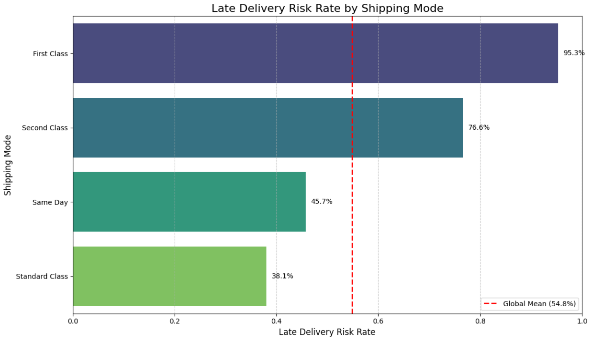
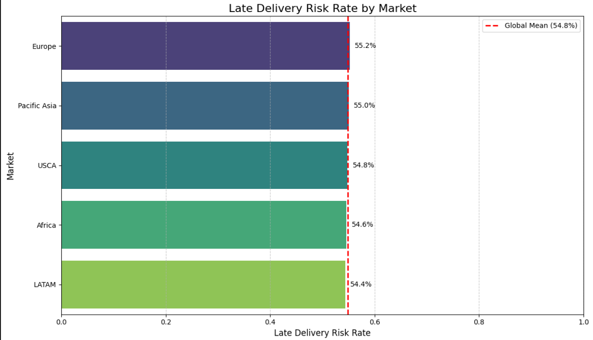
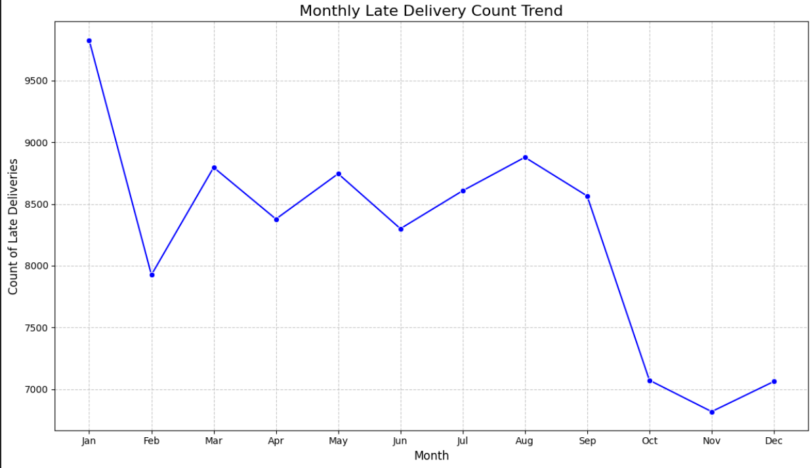

# Supply Chain Performance Analytics

Exploratory Data Analysis (EDA) on a global supply chain dataset to identify operational inefficiencies, quantify delivery risks, analyze logistics performance, and generate actionable business insights across shipping modes, markets, regions, and customer segments.

---

## Overview

Supply chain performance directly impacts customer satisfaction, operational efficiency, and business profitability. Delayed deliveries can lead to increased costs, customer churn, cancellations, and revenue loss.

This project applies Python-based analytics to investigate delivery performance across a large-scale global supply chain dataset containing over 180,000 records and 53 business variables.

The objective is to uncover patterns behind late deliveries, identify operational bottlenecks, and provide data-driven recommendations for improving supply chain performance.

---

## Business Questions Answered

- Which shipping modes experience the highest delivery delays?
- Which markets and regions have the highest delivery risk?
- How do delivery patterns vary throughout the year?
- Which operational areas contribute most to logistics inefficiencies?
- How do order outcomes vary across different customer and market segments?
- What trends can be identified to improve supply chain decision-making?

---

## Key Analyses

### 1. Delivery Performance Analysis

- Shipping Mode Comparison
- Delay Risk Assessment
- Delivery Performance Benchmarking
- Operational Efficiency Evaluation

### 2. Market & Regional Analysis

- Market-Level Delay Risk
- Regional Performance Comparison
- Geographic Risk Assessment
- Cross-Market Benchmarking

### 3. Order Status Analysis

- Completed Orders
- Pending Orders
- Cancelled Orders
- Delivery Outcome Trends

### 4. Seasonal Trend Analysis

- Monthly Delivery Performance
- Peak Delay Periods
- Seasonal Logistics Patterns
- Demand and Fulfillment Trends

### 5. Operational Risk Assessment

- Late Delivery Risk Identification
- High-Risk Segment Detection
- Performance Gap Analysis
- Logistics Bottleneck Detection

---

## Key Insights

- Delivery performance varies significantly across shipping modes.
- Certain markets consistently exhibit higher late-delivery risk than others.
- Seasonal fluctuations affect delivery efficiency and fulfillment performance.
- Order outcomes differ across regions and operational channels.
- Data-driven monitoring can help identify logistics bottlenecks before they impact customers.
- Supply chain analytics can support operational planning and improve service quality.

---

## Key Visualizations

### Shipping Mode Performance Analysis



### Regional Delivery Risk Analysis



### Market-Level Delivery Risk Analysis


### Order Status Analysis


### Seasonal Delivery Trends



---

## Tech Stack

| Tool | Purpose |
|--------|--------|
| Python | Data Analysis |
| Pandas | Data Cleaning & Transformation |
| NumPy | Numerical Analysis |
| Matplotlib | Data Visualization |
| Seaborn | Statistical Visualization |
| Jupyter Notebook | Analysis Environment |

---

## Skills Demonstrated

### Data Analytics

- Exploratory Data Analysis (EDA)
- Data Cleaning
- Data Transformation
- Feature Engineering
- KPI Analysis
- Data Visualization

### Business Analytics

- Performance Analysis
- Trend Identification
- Operational Analytics
- Decision Support
- Business Insight Generation

### Supply Chain Analytics

- Logistics Analysis
- Delivery Performance Monitoring
- Risk Assessment
- Process Optimization
- Operational Efficiency Analysis

### Technical Skills

- Python
- Pandas
- NumPy
- Matplotlib
- Seaborn
- Jupyter Notebook

---

## Project Structure

```text
Supply-Chain-Performance-Analytics/

├── Supply_Chain_Performance_Analytics.ipynb
├── README.md
└── images/
    ├── shipping_mode_analysis.png
    ├── regional_delay_analysis.png
    ├── market_risk_analysis.png
    ├── order_status_analysis.png
    └── seasonal_trends.png
```

---

## How to Run

```bash
git clone https://github.com/your-username/Supply-Chain-Performance-Analytics.git

cd Supply-Chain-Performance-Analytics

pip install pandas numpy matplotlib seaborn jupyter

jupyter notebook Supply_Chain_Performance_Analytics.ipynb
```

---

## Business Impact

This project demonstrates how analytics can be used to:

- Improve logistics performance
- Monitor delivery efficiency
- Identify operational bottlenecks
- Support business decision-making
- Improve customer experience
- Enhance supply chain visibility

---

## Author

**Rithish Rao**  
BITS Pilani Hyderabad Campus  
Mechanical Engineering

Interested in Data Analytics, Business Analytics, Product Analytics, Operations Analytics, and Financial Analytics.
